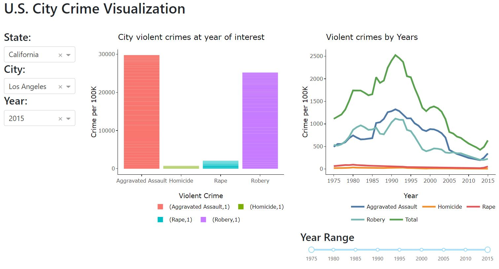

# Violent Crime Visualizer in US Cities

Team members: Fei Chang, Mengyuan Zhu, Jingjing Zhi, Pan Fan

## Description of App

The deployment on heroku:https://crimvizr.herokuapp.com/

The interactive app contains a landing page that shows bar chart of major violent crimes  and a line chart of evolution of violent crimes in a U.S. city . The data visualization tool sums up the number of crimes per 100k capita in four categories and a total number of criminal conducts. The app aims to facilitate people for a quick view on the city crimes. 

The app is set to display the average criminal conducts of all cities in each year. The app allows users to filter out the specific information geographically and chronologically from the dropdown and slider bar menus on the left. For example, a user can find the state of interest from the `State` dropdown menu. After picking a state, the user can also specify a city/county in the state from the `City` dropdown menu. Furthermore, the user can specify the time period to display the bar charts from the slider bar. Probably, the crimes over the recent decade are more informative.

In general, the dashboard can clearly display the number of violent crimes in state or city of interest. A user can assess their safety before visting a new city.

## Display of the dashboard

## License

Please refer to the License File [here](https://github.com/UBC-MDS/mds532_viz_group25-R/blob/main/LICENSE)
